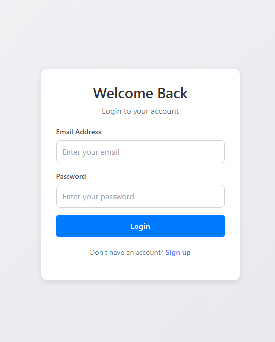
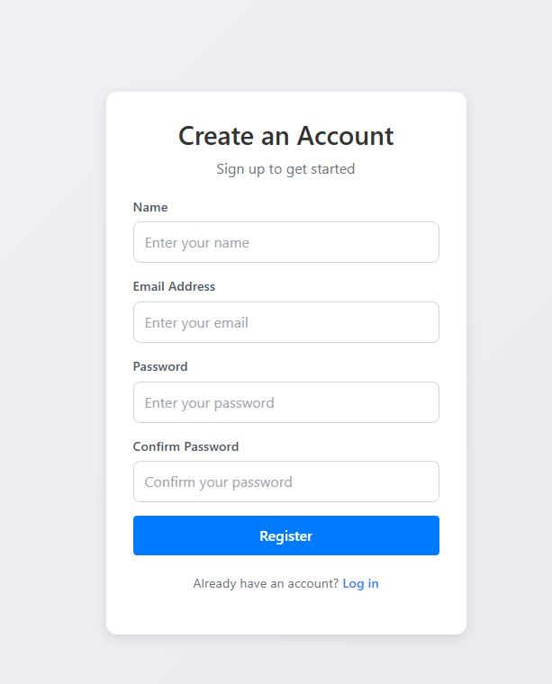
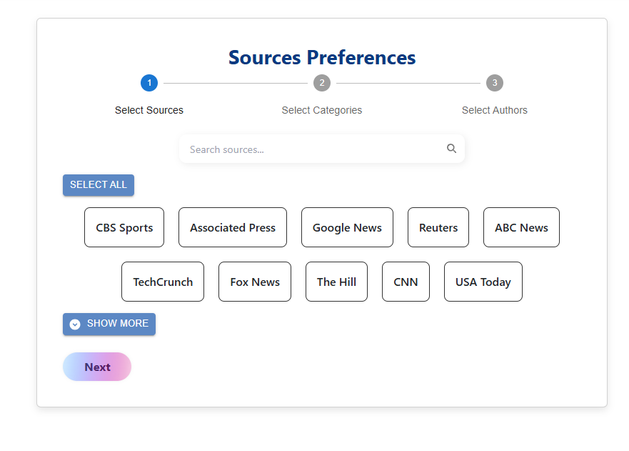
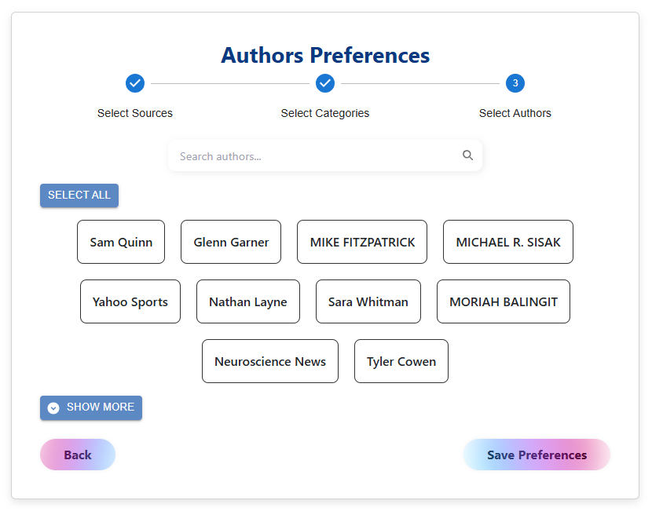
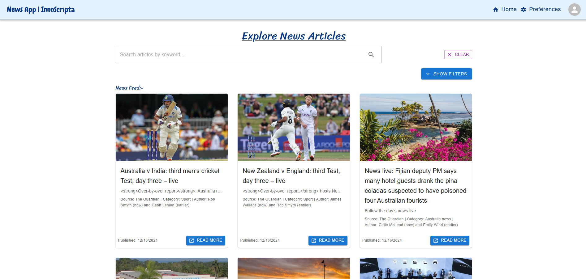
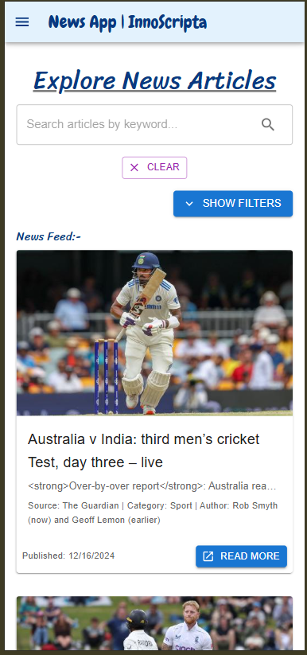
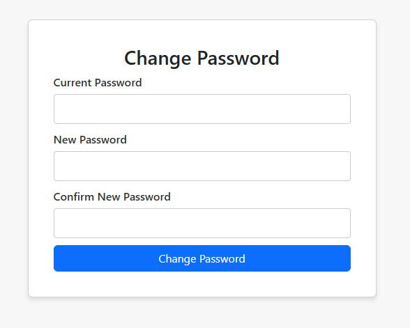
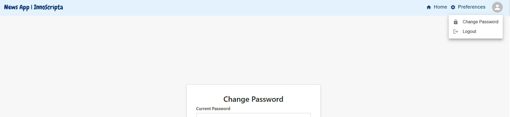

# News App | InnoScripta

Steps to Run the Project:- 

# Using Docker

### `docker-compose.exe build`

### `docker-compose.exe up -d`

Runs the app in the development mode.\
Open [http://localhost:3000](http://localhost:3000) to view it in your browser.

Backend is hosted on [http://localhost:8000](http://localhost:8000) 
8000 Port

# Manully

Installation
Clone the Repository

### `git clone https://github.com/manpreetsingh78/news-app.git`
BACKEND
### `cd news-app/backend`

Install Dependencies
### `composer install`

Configuration
Environment Variables

### `Copy the example environment file `

### `cp .env.example .env`

### `php artisan migrate`

### `php artisan articles:fetch` # to fecth news articles from News API.

### `php artisan serve` # to run the backend server

FRONTEND
### `cd news-app/frontend`

### `npm install`

### `npm start` # this will start the frontend app on 3000 PORT

Open [http://localhost:3000](http://localhost:3000) to view it in your browser.

